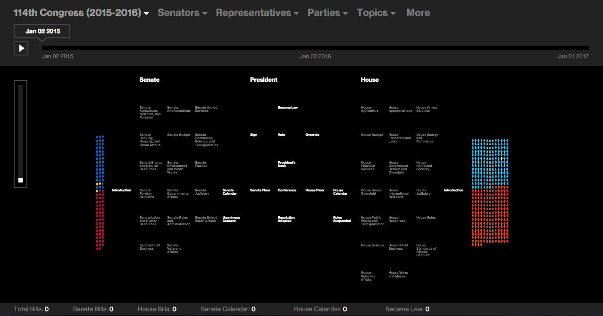
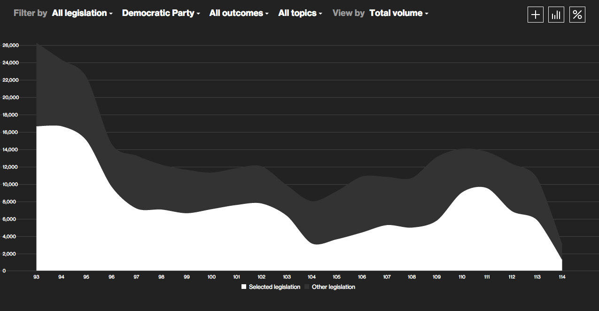

# Legex
[Legex](http://legex.org) is an online application of [Center for American Politics and Public Policy](http://cappp.org/) at the University of Wasingthon to study and trace the federal legislative process in the US. In this repository there is the back-end code that collects and manages the bills data for legex.

  

  

